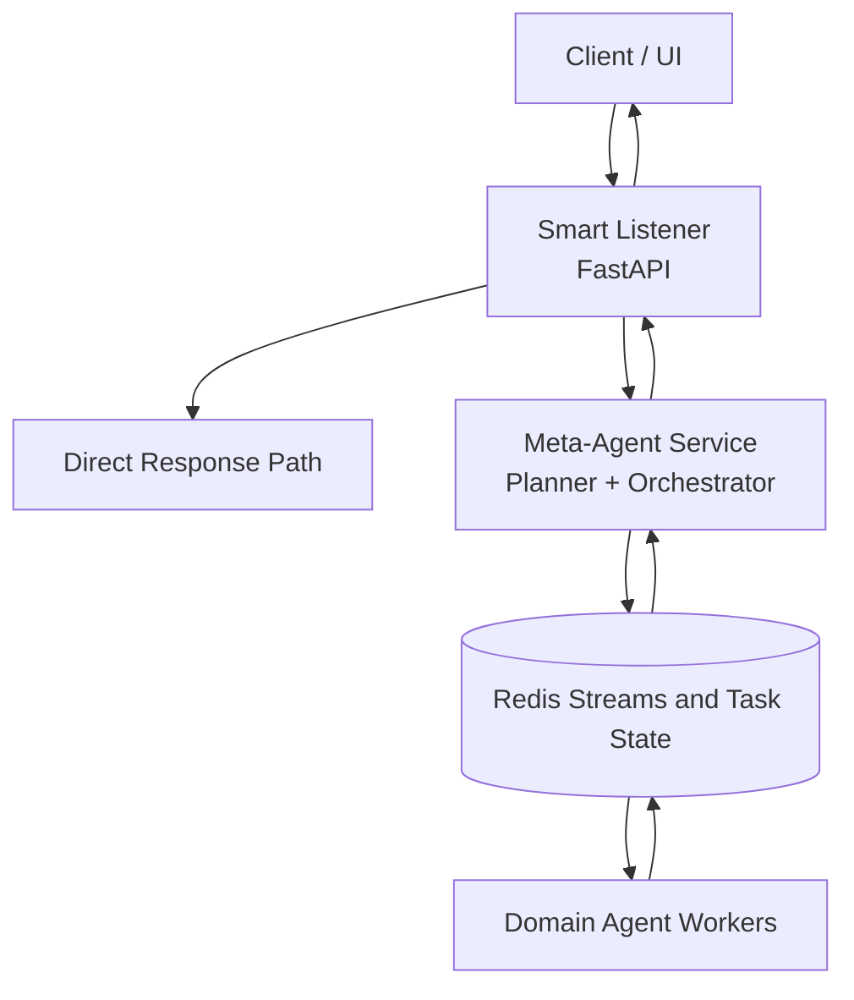
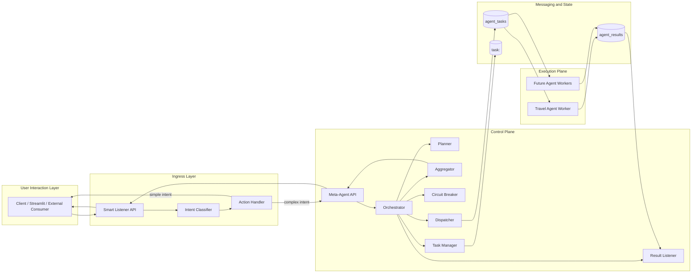
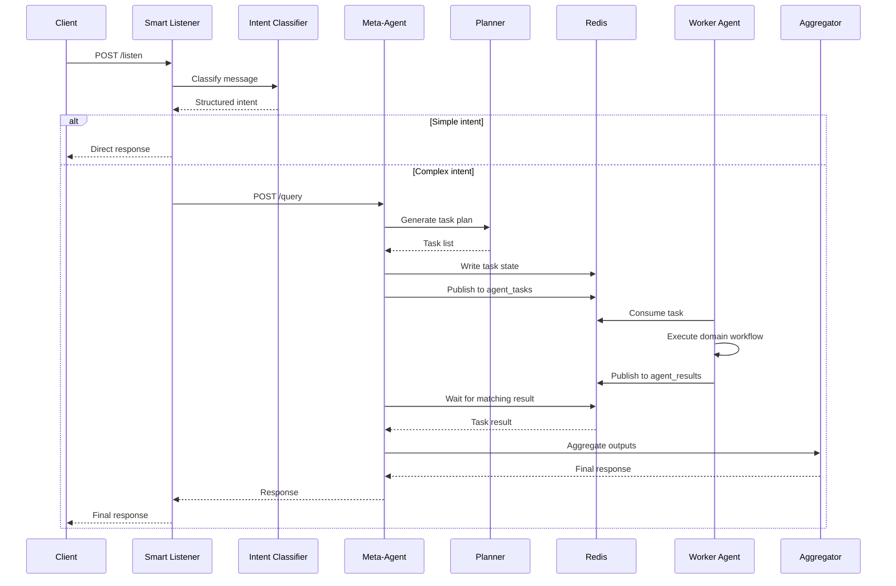
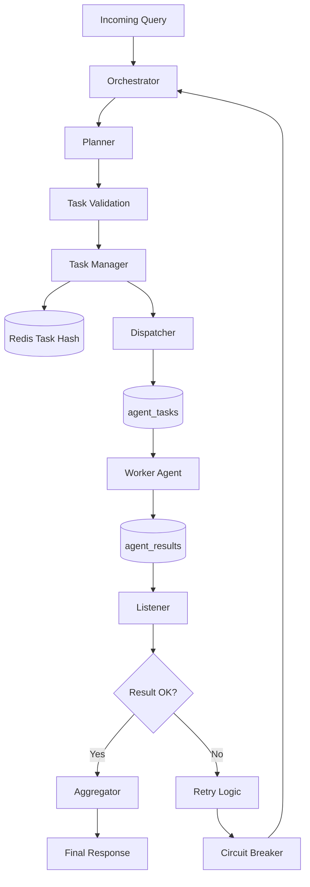
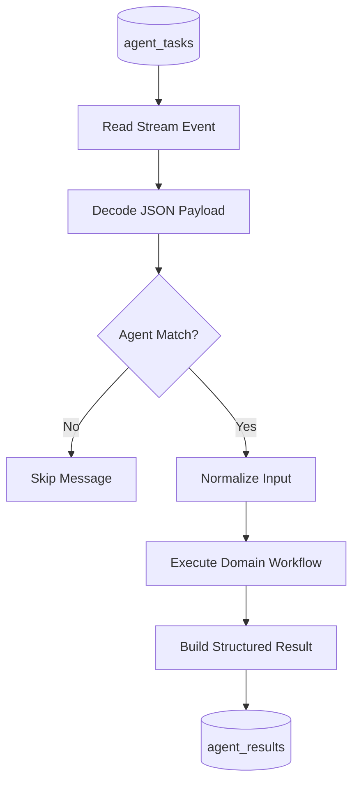
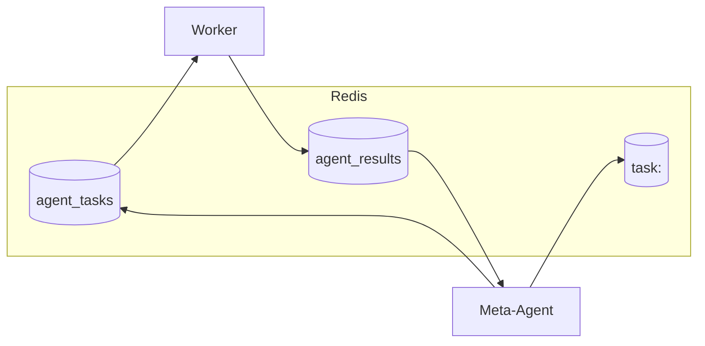

# Mini Jarvis

## Principal Architecture Review and Design Narrative

## 1. Executive Summary

Mini Jarvis is an event-driven, multi-agent assistant platform designed to translate unstructured user requests into specialized domain workflows. The current implementation already demonstrates the right architectural instincts for a scalable AI system:

- an intelligent ingress layer for intent understanding
- a central orchestration layer for planning and delegation
- decoupled worker agents for domain execution
- asynchronous transport through Redis Streams

In its present form, the system is best described as a strong MVP of a production-style agent platform. It proves the end-to-end loop from user message to delegated execution and synthesized answer, while leaving clear extension points for scale, resilience, governance, and multi-agent concurrency.

From an architectural perspective, the most important design choice is the separation of concerns:

- `Smart Listener` handles user-facing interpretation and routing
- `Meta-Agent` owns planning, task lifecycle, and coordination
- `Domain Agents` execute bounded domain work
- `Redis` provides temporal decoupling between orchestration and execution

This separation keeps the system modular, independently deployable, and easier to evolve than a monolithic "single LLM app" design.

## 2. Architectural Goals

The effective design goals, inferred from the implementation, are:

- accept natural-language requests through a lightweight API
- classify whether the request can be answered immediately or requires orchestration
- transform high-level intent into structured executable tasks
- delegate tasks to specialized agents without tight runtime coupling
- support asynchronous execution and eventual response collection
- provide a foundation for adding new domain agents over time

Equally important are the implied non-goals of the current version:

- it is not yet a full conversational memory system
- it is not yet a policy-governed enterprise agent platform
- it is not yet optimized for high-throughput parallel task graphs
- it is not yet operating with full production observability and SLO enforcement

That framing matters in interviews: the system is appropriately scoped. It is solving the right first-order architecture problem before prematurely over-engineering secondary concerns.

## 3. System Context

At a system level, Mini Jarvis follows this interaction model:

1. A client sends a natural-language request.
2. Smart Listener classifies the request and extracts structured intent.
3. Simple intents are answered immediately.
4. Complex intents are forwarded to the Meta-Agent.
5. The Meta-Agent generates an execution plan.
6. Each plan step becomes a task with its own lifecycle and identifier.
7. Tasks are published to Redis Streams for asynchronous execution.
8. A domain worker consumes the task, performs specialized work, and publishes a result.
9. The Meta-Agent correlates results, applies retries and failure handling, aggregates outputs, and returns the final response.

This is a classic control-plane/data-plane split:

- the control plane is Smart Listener plus Meta-Agent
- the execution plane is the fleet of domain agents

That distinction is one of the strongest aspects of the design. It allows orchestration logic to evolve independently from domain-specific execution logic.

## 4. High-Level Architecture

The high-level architecture can be described as a layered AI platform with clear ownership boundaries between user interaction, orchestration, messaging, and domain execution.

### High-Level System Diagram



```text
Client
  |
  v
Smart Listener (FastAPI)
  |
  +--> Direct Response Path
  |
  +--> Meta-Agent Service (FastAPI)
         |
         +--> Planner
         +--> Task Manager
         +--> Dispatcher
         +--> Listener
         +--> Aggregator
         |
         v
      Redis
       |- agent_tasks
       |- agent_results
       |- task:<task_id>
         |
         v
   Domain Agent Workers
       |- travel_agent
       |- future agents
```

### High-Level View

At a strategic level, the platform consists of four major layers:

- Experience layer: the client or UI that sends natural-language requests
- Intelligence ingress layer: Smart Listener, which performs intent understanding and request routing
- Orchestration layer: Meta-Agent, which creates plans, manages task lifecycle, and synthesizes results
- Execution layer: domain agents that perform specialized work asynchronously

Redis acts as the event backbone between orchestration and execution. This keeps the orchestrator logically central without making it operationally synchronous with worker agents.

### Container-Level Architecture Diagram



### High-Level Responsibilities by Layer

#### Client Layer

- captures user intent
- sends requests to a single stable API surface
- remains decoupled from agent topology and execution complexity

#### Smart Listener Layer

- interprets free-form language
- determines whether a request is simple or orchestration-worthy
- standardizes the contract passed into the platform core

#### Meta-Agent Layer

- converts intent into executable work
- maintains workflow state and coordination logic
- enforces retries, timeout handling, and result aggregation

#### Agent Layer

- executes specialized domain logic
- encapsulates tools, prompts, and service-specific workflows
- isolates failures and changes within bounded domains

### High-Level Design Rationale

This architecture is effective because it prevents three common failure modes in AI systems:

- too much logic at the edge, which makes APIs brittle
- too much domain coupling in the orchestrator, which creates a monolith
- synchronous chaining across services, which hurts resilience and latency control

By separating understanding, orchestration, and execution, the platform remains easier to scale organizationally and technically.

## 5. Low-Level Architecture

The low-level architecture describes how requests move through concrete services, runtime objects, storage structures, and message contracts.

### Sequence Diagram



### Low-Level Request Flow

```text
1. Client -> POST /listen
2. Smart Listener Router -> IntentClassifier
3. IntentClassifier -> LLM -> structured intent JSON
4. ActionHandler ->
   a. direct response, or
   b. HTTP call to Meta-Agent /query
5. Meta-Agent Orchestrator -> Planner
6. Planner -> execution plan with one or more tasks
7. TaskManager -> create task:<task_id> in Redis
8. Dispatcher -> publish task to Redis stream agent_tasks
9. Worker -> consume task addressed to matching agent
10. Domain Agent -> execute workflow/tools
11. Worker -> publish result to agent_results
12. Listener -> correlate matching task_id
13. Aggregator -> compose final response
14. Meta-Agent -> HTTP response to Smart Listener
15. Smart Listener -> final response to client
```

### Low-Level Component Interaction

#### Smart Listener Internals

Smart Listener has three main implementation units:

- API layer
- router
- action handler

Detailed path:

1. FastAPI validates the inbound payload.
2. The router extracts the user message.
3. `IntentClassifier` prompts the LLM for structured JSON.
4. Parsed intent is passed to `ActionHandler`.
5. `ActionHandler` either returns a direct reply or forwards the request to the Meta-Agent over HTTP.

This design keeps HTTP concerns, classification logic, and routing behavior isolated from each other.

### Meta-Agent Internal Architecture Diagram



#### Meta-Agent Internals

The Meta-Agent runtime centers on the orchestrator and its collaborating modules:

- `Planner`
- `TaskManager`
- `Dispatcher`
- `Listener`
- `Aggregator`
- `CircuitBreaker`

Detailed path:

1. `Orchestrator.run()` receives the normalized query.
2. `Planner` asks the LLM for a valid task plan.
3. Each task is assigned a `task_id`.
4. `TaskManager` writes task state into Redis.
5. `Dispatcher` serializes the task as a JSON payload in the `data` field.
6. `Listener` waits on `agent_results` for a matching `task_id`.
7. On success, `Aggregator` combines outputs.
8. On failure, retry and circuit-breaker logic decide whether to re-dispatch, fail fast, or return an error.

#### Worker Internals

Each worker performs a narrow execution loop:

1. read a message from `agent_tasks`
2. parse the `data` field JSON
3. check whether the `agent` field matches the worker capability
4. normalize task input if needed
5. execute domain logic
6. publish a structured result to `agent_results`

This keeps workers simple and replaceable. A worker only needs to understand the task contract and the domain workflow it owns.

### Worker Execution Diagram



### Low-Level Data Contracts

#### Intent Contract

Smart Listener expects classification output similar to:

```json
{
  "primary_intent": "travel",
  "entities": {
    "destination": "Goa"
  },
  "constraints": ["budget under 30000"],
  "required_agents": ["travel_agent"]
}
```

#### Task Contract

The Meta-Agent dispatches tasks shaped like:

```json
{
  "agent": "travel_agent",
  "action": "create_trip_plan",
  "input": {
    "query": "Plan a budget trip to Goa next month"
  },
  "task_id": "uuid"
}
```

#### Result Contract

Workers return results shaped like:

```json
{
  "task_id": "uuid",
  "agent": "travel_agent",
  "status": "success",
  "output": "final itinerary text"
}
```

### Low-Level Redis Model

Redis currently stores three operational artifacts:

- `agent_tasks`
  - append-only dispatch stream for worker consumption
- `agent_results`
  - append-only result stream for orchestrator correlation
- `task:<task_id>`
  - Redis hash for task metadata such as status, retry count, and timestamps

This gives the platform a lightweight split between transport state and task state.

### Redis Data Model Diagram



### Low-Level Failure Handling

Failure handling currently happens at multiple points:

- classification parse failure falls back to `unknown`
- downstream Meta-Agent HTTP failure returns an error-safe listener response
- worker failure results in a failed result event or timeout
- orchestration retry logic attempts transient recovery
- circuit breaker protects against repeatedly invoking unhealthy agents

From a low-level design perspective, this is important because resilience is not concentrated in one component. It is distributed across the lifecycle.

## 6. Core Components

### 5.1 Smart Listener

Smart Listener is the user-facing ingress service. Its job is not to solve domain problems, but to normalize requests into routing decisions.

Current responsibilities:

- expose `POST /listen`
- validate incoming payloads
- classify user intent with an LLM
- extract entities and constraints
- determine whether the query is trivial or requires downstream orchestration

Architecturally, this is a good boundary. The listener acts as an API gateway specialized for AI workloads. It centralizes intent understanding without leaking domain execution logic into the edge layer.

Why this matters:

- upstream clients integrate with one stable endpoint
- orchestration remains hidden behind a cleaner contract
- simple requests avoid unnecessary distributed execution cost
- future features such as authentication, rate limiting, session metadata, or safety filters can be inserted at the ingress point

### 5.2 Meta-Agent Service

The Meta-Agent is the coordination brain of the system. It translates intent into execution.

Current responsibilities:

- accept structured query requests
- generate a task plan using an LLM-backed planner
- assign unique task IDs
- persist task state
- dispatch work through Redis Streams
- wait for results with timeout handling
- retry failed work
- aggregate outputs into a user-facing response
- apply circuit-breaker protection around unstable downstream agents

This service is effectively the orchestrator and should be treated as the system’s control plane. In mature architectures, this layer becomes the most important place to enforce workflow correctness, policy, idempotency, and observability.

### 5.3 Redis Communication Layer

Redis is currently serving three different but complementary roles:

- task transport via `agent_tasks`
- result transport via `agent_results`
- task state persistence via `task:<task_id>` hashes

This is a sensible choice for the current scale of the system. Redis Streams offer a lightweight way to decouple orchestration from worker execution while preserving ordered append-only event semantics.

The design benefit is temporal decoupling:

- the Meta-Agent does not need to know which worker instance will execute a task
- workers can scale independently
- transient worker unavailability does not require synchronous request blocking at dispatch time

The tradeoff is that stream-based systems demand stronger message contracts, consumer-group discipline, replay strategy, and dead-letter handling as concurrency grows.

### 5.4 Domain Agents

The first implemented domain agent is the travel-planning agent. It is a useful proof point because it demonstrates that domain work is not just a prompt wrapper, but a composed agent workflow with tools, external context, and potentially long-running execution.

Current capabilities include:

- itinerary generation
- weather-aware suggestions
- cost estimation
- recommendations for places and trip options
- both synchronous API execution and asynchronous worker execution

This agent is built using LangGraph, which is a good fit for tool-using agent loops because it makes state transitions explicit and keeps the reasoning-plus-tools pattern more inspectable than an opaque chain.

## 7. End-to-End Workflow

The current request lifecycle can be understood as a five-stage pipeline.

### Stage 1: Intent Ingestion

The client submits a natural-language message such as a travel request. Smart Listener classifies the request, extracts structured context, and decides whether the request can be answered directly.

### Stage 2: Planning

If orchestration is required, the request is forwarded to the Meta-Agent. The planner converts the request into a structured execution plan constrained by the agents currently supported by the platform.

### Stage 3: Taskization

Each planned step becomes a task object containing:

- target agent
- action
- input payload
- task identifier

Task state is recorded in Redis so the system can track lifecycle metadata separately from message transport.

### Stage 4: Asynchronous Execution

Tasks are published to `agent_tasks`. Domain workers consume relevant messages, execute the task, and emit a result to `agent_results`.

### Stage 5: Correlation and Synthesis

The Meta-Agent listener waits for the matching `task_id`, interprets success or failure, applies retries when configured, and passes successful outputs to the aggregator for the final response.

This staged design is clean, understandable, and extensible. It demonstrates a genuine distributed systems mindset rather than a tightly coupled HTTP chain.

## 8. Architectural Strengths

Several design decisions stand out as especially strong for an interview setting.

### Clear Separation of Responsibilities

The ingress, planning, execution, and aggregation concerns are separated into different layers. This reduces cognitive coupling and makes the architecture easier to evolve.

### Async-by-Default Execution Model

Using Redis Streams as the coordination backbone avoids binding the user request lifecycle directly to domain worker execution. That is a strong foundation for resiliency and scale.

### Domain Isolation

The travel agent is encapsulated as a specialized worker. This is the right pattern for adding future domains such as calendar, reminders, email, shopping, or finance without turning the orchestrator into a God service.

### Explicit Task Lifecycle

Attaching task IDs, retries, timestamps, and status metadata is an important step toward traceability, idempotency, and debugging. Many early AI systems skip this and become difficult to operate.

### Practical Reliability Patterns

Retry logic, timeout handling, and circuit breakers are already present. Even if still basic, these patterns show good production instincts.

## 9. Principal-Level Design Critique

The current design is solid, but principal-level evaluation requires calling out where it will bend under growth.

### 8.1 The Planner Contract Is Still Soft

The planner is LLM-driven and the current schema validation is lightweight. That is acceptable for an MVP, but in a larger system it creates orchestration fragility.

Risk:

- malformed plans may dispatch invalid tasks
- unsupported agents or actions may leak into execution
- retries may repeatedly re-run fundamentally invalid work

Principal recommendation:

- enforce strict versioned schemas for plan, task, and result payloads
- validate agent names and allowed actions against an agent registry
- distinguish planner failure from worker failure

### 8.2 Worker Discovery Is Implicit

Today, the orchestrator assumes workers exist and know how to consume tasks. That works in a demo system, but it does not scale operationally.

Risk:

- no visibility into active agents
- no routing policy by capability or health
- difficult rollout of multiple worker versions

Principal recommendation:

- introduce an agent registry with agent capability metadata
- track worker heartbeats and health status
- route based on capability, version, and availability

### 8.3 Sequential Orchestration Limits Throughput

The system currently executes tasks sequentially. That keeps orchestration simple, but it also constrains latency and leaves performance on the table for independent subtasks.

Principal recommendation:

- evolve from a linear task list to a DAG-based execution model
- allow safe parallelism for independent tasks
- preserve dependency ordering only where required

This change would be especially important once multiple specialist agents are introduced.

### 8.4 Listener Correlation Will Become a Concurrency Bottleneck

A single-stream listening approach with simple `task_id` matching is fine at low scale, but high concurrency will expose correlation and scanning inefficiencies.

Principal recommendation:

- adopt consumer groups or more formal subscription patterns
- consider per-request correlation channels or indexed result lookup
- add dead-letter queues and replay semantics

### 8.5 Reliability State Is Not Yet Durable Enough

The circuit breaker is in-memory and task metadata has short-lived persistence. This means resilience behavior resets across process restarts.

Principal recommendation:

- persist reliability state when operational continuity matters
- separate transient execution state from durable audit state
- define explicit recovery behavior after restart

### 8.6 Observability Is Underpowered for Multi-Agent Production

The current implementation tracks some task metadata, but a real multi-agent platform requires richer telemetry.

Principal recommendation:

- emit trace IDs across listener, orchestrator, Redis, and worker hops
- capture per-step latency, token usage, retry counts, and failure cause
- introduce structured logs and metrics by agent, action, and outcome
- define service-level objectives for latency and success rate

## 10. Non-Functional Architecture

Strong architecture documentation should go beyond component boxes and address operational characteristics.

### Scalability

The design scales horizontally in the right places:

- multiple Smart Listener instances can sit behind a load balancer
- Meta-Agent instances can scale statelessly if task coordination remains Redis-backed
- domain workers can scale independently by agent type

The biggest scalability constraint today is orchestration sophistication rather than raw deployment topology.

### Reliability

The system already includes the beginnings of production resilience:

- retries for transient task failures
- timeouts for missing results
- circuit breakers for unhealthy downstream agents

To move toward production-grade reliability, it would need:

- idempotent task processing
- dead-letter queues
- poison-message handling
- replay and recovery semantics
- durable workflow state for long-running jobs

### Security and Trust Boundaries

Because the system is LLM-driven and tool-using, security is not just an API concern. It is also a prompt and tool-governance concern.

The architecture should explicitly treat the following as trust boundaries:

- user input entering Smart Listener
- planner output becoming executable tasks
- tool invocations inside domain agents
- inter-service payloads crossing Redis

A mature version should include:

- schema validation on every inter-service contract
- prompt-injection defenses at ingress and retrieval/tool boundaries
- authentication and authorization between services
- auditability for high-impact actions

### Operability

This architecture is operable in development, but a production operator would ask:

- Which task is stuck?
- Which agent is degraded?
- Which retries are transient versus deterministic?
- Which plans are failing validation most often?
- What is the end-to-end latency budget?

A principal-level design should answer these with dashboards, traceability, and explicit failure states.

## 11. Recommended Evolution Path

The strongest next steps are not random feature additions; they are platform-hardening moves.

### Near Term

- add a formal agent registry
- strengthen Pydantic validation for planner and worker contracts
- make task and result schemas versioned
- improve structured logging and request tracing
- fix task inspection and operational visibility gaps

### Medium Term

- introduce DAG-based execution for parallelizable work
- add consumer-group semantics and dead-letter processing
- persist circuit breaker and workflow recovery state
- support multiple domain agents with explicit capability routing

### Long Term

- add policy enforcement and permission-aware actions
- introduce memory and personalization as separate subsystems, not ad hoc agent state
- define evaluation pipelines for planner quality, routing accuracy, and agent correctness
- evolve from a single orchestration service into a more formal workflow runtime if complexity justifies it

## 12. Interview-Ready Positioning

If presented in an interview, Mini Jarvis should be described as:

"A modular multi-agent assistant platform built with a control-plane and worker-plane split. The ingress layer performs intent understanding, the orchestrator converts requests into executable tasks, Redis decouples planning from execution, and specialized agents perform domain work. The current version is intentionally scoped as an MVP, but the architecture already includes the right seams for scaling into a more robust agent platform with registry-based routing, parallel execution, stronger contracts, and production observability."

That framing is stronger than simply saying "it uses FastAPI, Redis, and LangGraph." It shows architectural intent, not just implementation detail.

## 13. Final Assessment

Mini Jarvis is not yet a fully mature agent platform, but it is architecturally well-composed. Its biggest strength is not the current number of agents; it is the fact that the system has already been decomposed along the right boundaries:

- intent understanding at the edge
- orchestration in the control plane
- domain execution in isolated workers
- asynchronous transport through a message backbone

That is exactly the kind of foundation that can evolve into a serious AI platform.

The next leap is not adding more prompts. It is hardening the orchestration model: stronger contracts, richer observability, explicit agent registration, and safe parallel execution. Once those are in place, Mini Jarvis moves from an interesting prototype to a credible production architecture.
